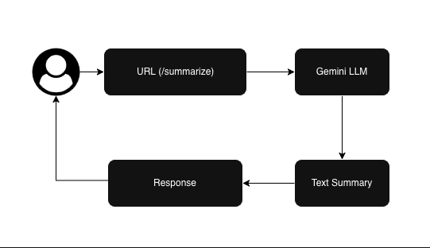

Text Summarization API

A lightweight, API that automatically summarizes long pieces of text into clear, concise summaries. Whether you’re building a content analysis tool, integrating summarization into a chatbot, or processing large volumes of documents, this API makes it easy to extract the core meaning of any text in seconds.

How it works:
Send a POST request with your text payload to the API endpoint, and get back a JSON response containing a well-structured summary. You control the summary length and style through simple parameters, letting you choose between brief overviews or more detailed digests.

Key features:
- Accepts plain text input (articles, transcripts, documents, etc.)
- Returns summaries optimized for readability and coherence
- Configurable compression ratio or target word count
- Lightweight, stateless design for easy deployment in any environment

Example request:
`POST /summarize  
Content-Type: application/json  

{
  "text": "Your long text goes here...",
  "max_tokens": 500
}
`

Example response:
`{
  "summary": "This is the concise summary of your text."
}
`